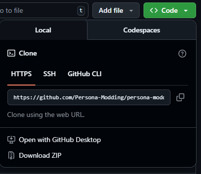
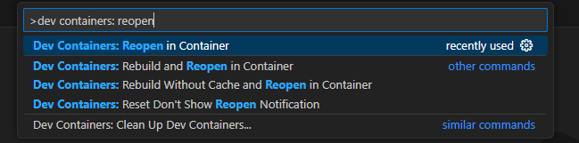
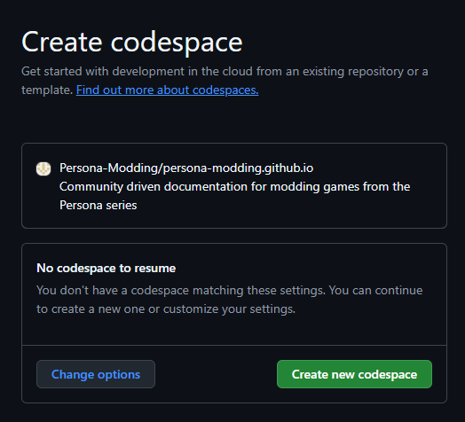
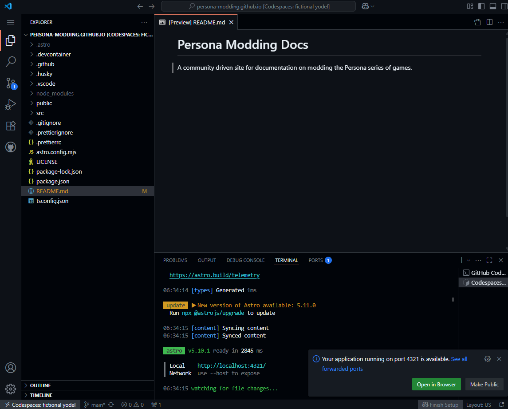
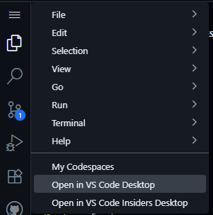
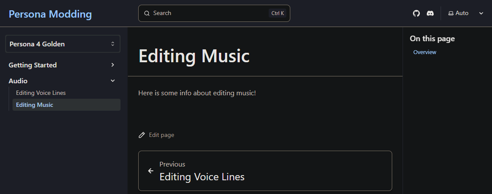

import { Aside, FileTree } from "@astrojs/starlight/components";

All of the documentation on this site is open source and written by community members like you. All contributions are appreciated :)

<Aside>
Currently you *sort of* need to write code to work on the documentation on this site. However, everything you need to know will be explained here, so don't worry, you should be fine regardless of your current knowledge.

In the future, there may be a more beginner friendly way to edit the docs, but for now this will have to do.

</Aside>

## Setting Up

The first thing you'll need to do is set up an environment to use for editing the documentation. You can either do this locally or in a browser using GitHub's code spaces feature which is free for 60 hours of use a month (probably more than enough).

### Local Setup

To work with these docs locally you will need

- A Git client such as [Git](https://git-scm.com/downloads) (CLI) or [GitHub Desktop](https://desktop.github.com/download/) (GUI for Windows and Mac)
- An IDE that supports web development such as [VS Code](https://code.visualstudio.com/download) (what this guide assumes you are using)
- [Node.js](https://nodejs.org/en/download) (and npm) - version 22 will work, others are probably fine too
- **OR** [Docker](https://www.docker.com/) if you want to use a [dev container](https://containers.dev/) instead of a local install

If you choose to run locally, I'll assume that you are capable of installing the above yourself by following their documentation. If you have trouble, consider switching to a [Browser Setup](#browser-setup). It's not that different and you can even still use the vscode desktop app with it (follow that section thorugh to the end to see).

With the above setup complete, clone the [repository](https://github.com/Persona-Modding/persona-modding.github.io) for the docs by clicking the **Code** button, selecting the appropriate option.



Then open up your copy of the repo in the IDE of your choice (such as VS Code).

If you are using your local node install run `npm install` to do the initial setup.
After this finishes you can run `npm run dev` to start up the app. Open up the link that is printed to the browser (probably http://localhost:4321/) to see the live preview of the site.


If you'd rather use a dev container, first install the [Dev Containers extension](https://marketplace.visualstudio.com/items?itemName=ms-vscode-remote.remote-containers) in VS Code.


Then with the repo open, run the **Dev Containers: Reopen In Container** command from the command palette (which can be opened with `ctrl+shift+p`).



Wait a little bit and a new window will open up which is inside of the dev container. When first created this automatically runs `npm install` and whenever you open up the container it automatically runs `npm run dev` so you should immediately be ready to start editing.

<Aside type="tip">
The dev container also comes with the [Astro](https://marketplace.visualstudio.com/items?itemName=astro-build.astro-vscode), [MDX](https://marketplace.visualstudio.com/items?itemName=unifiedjs.vscode-mdx), and [Prettier](https://marketplace.visualstudio.com/items?itemName=esbenp.prettier-vscode) extensions installed.

If you're not using the dev container you should install these yourself.

</Aside>

At this point you should be good to go. Skip to the [Writing Docs](#writing-docs) section to get started actually making changes.

### Browser Setup

You can work on these docs entirely in a browser using a GitHub code space by clicking the button below.
[](https://codespaces.new/Persona-Modding/persona-modding.github.io?quickstart=1)

Assuming you haven't already setup a code space you will be asked to create a new one. The default settings should be fine so just click **Create new codespace**.



You will be redirected to a new page that looks a lot like vscode (it is vscode). Wait about a minute and it will automatically set itself up.
You should see a pop up with an **Open in Browser** button pop up in the corner after a little bit. Click on that and you'll be given a live preview of the site!



You can also get to this by going to the **Ports** tab and clicking on the **Forwarded Address** that shows up for port 4321.


<Aside type="tip">
The [dev container](https://containers.dev/) that you are using when running in this code space is setup to automatically run the command `npm run dev` when you attach to it. This is how the site automatically builds and gives you that pop up.

If you need to you can always manually run `npm run dev` yourself in the built in terminal (which can be opened with `` ctrl+shift+` ``). You can also stop it from running by typing `ctrl+c` in the terminal.

</Aside>

If you like using a codespace but want to edit in a desktop version of vscode (maybe because you keep accidentally closing the tab with `ctrl+w`) you can do that by clicking on the hamburger menu in the top left and selecting **Open in VS Code Desktop**.



Whichever way you go you'll get basically the same experience. Wherever the guides reference a vscode feature it will be about the same whether you're running locally, through a code space on a browser, or through a code space on the desktop app.

## Adding a Page

All documentation on this site is written in the [MDX](https://mdxjs.com/) format. These files are organised under the `src/content/docs` directory.

To add a new page firstly create an `mdx` file under the appropriate directory. For example, if you wanted to write documentation about editing music in P4G it may go under a directory like `src/content/docs/p4g/audio/editing-music.mdx`.
This `mdx` file needs to contain at least a `title` in its frontmatter. This will look like

```mdx
---
title: Editing music
---

TODO put some content here!
```

<Aside type="tip">
Frontmatter is any content within the two sets of `---`s at the top of an `mdx` file. It uses the YAML format, generally looking like `variable: value`.

Check out Starlight's [Frontmatter Reference](https://starlight.astro.build/reference/frontmatter/) for everything that you can use in it. Generally `title` and `description` are the only things you'd want to change.

</Aside>

To make your page accessible you also need to add it to the `starlightSidebarTopics` plugin configuration in the `astro.config.mjs` file. This defines how it shows in your sidebar.

For example, to add your Editing Music page to P4G's sidebar you would change the `starlightSidebarTopics` configuration like

```js ins={18}
starlightSidebarTopics([
          {
            label: "Persona 4 Golden (PC)",
            link: "/p4g",
            items: [
              "p4g",
              {
                label: "Getting Started",
                items: [
                  {
                    label: "Using Mods",
                    autogenerate: {
                      directory: "p4g/getting-started/using-mods/",
                    },
                  },
                  {
                    label: "Making Mods",
                    autogenerate: {
                      directory: "p4g/getting-started/making-mods/",
                    },
                  },
                ],
              },
              {
                label: "Audio Modding",
                autogenerate: {
                  directory: "p4g/audio/",
                },
              },
            ],
          },
]),
```

Generally, the `autogenerate` parameter should be used for new categories, as shown in the Audio Modding section, but if you want to have a category within a category, you will need to use the `items` parameter too, as shown in the Getting Started section.

With that done, you should now see your new Editing Music page under the Audio section of the P4G docs.



## Editing A Page

Just read the [Starlight Docs](https://starlight.astro.build/guides/authoring-content/) :)

For special characters, use their [HTML character references](https://developer.mozilla.org/en-US/docs/Glossary/Character_reference)

<Aside type="danger">
TODO - Actually write some stuff here. It's fine to reference th starlight docs (probably a good idea) but give some specific guidance.

Give some guidelines on how the docs should be written and stuff maybe

</Aside>

## Submitting Changes

It's just GitHub, make a PR and wait for someone to review it :)

<Aside type="danger">
  TODO actually give some steps, it's meant to be beginner friendly. I said no
  prior knowledge needed
</Aside>
