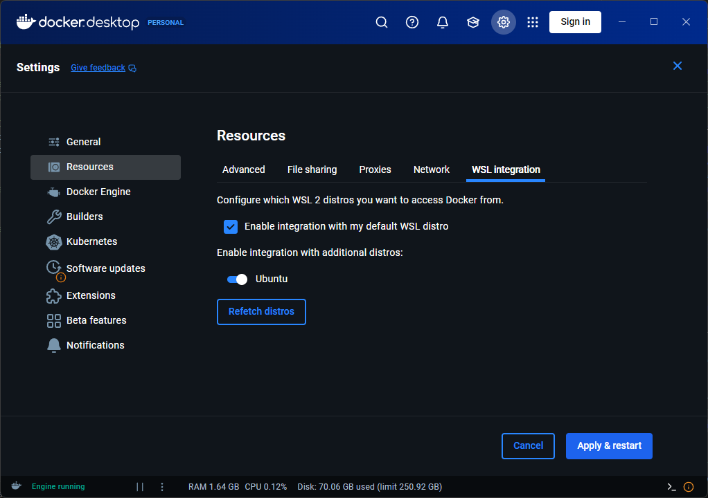

import { Aside, FileTree, Tabs, TabItem } from "@astrojs/starlight/components";

If you want to contribute to the documentation on this site there is a small amount of initial setup that is required.
There are three main ways you can do this, depending on your preferences:

<Tabs>
    <TabItem label="Full Local">
        Follow [Local Setup](#local-setup) and [Full Local](#full-local) sections.
        - Install NodeJS on your machine and run the site directly on it
        - Need a local Git Client for pulling and pushing changes
        - You have full control!
    </TabItem>
    <TabItem label="Local Dev Container">
        Follow [Local Setup](#local-setup) and [Dev Container](#dev-container) sections.
        - Run the site on your machine through a dev container
        - Requires Docker but guarantees a working environment
        - Don't need to deal with intalling/managing NodeJS
        - Still need a local Git Client for pulling and pushing changes
    </TabItem>
    <TabItem label="Github Code Space">
        Follow [Code Space Setup](#code-space-setup) section.
        - Run the site in a [Code Space](https://github.com/features/codespaces) managed by GitHub
        - Don't need to install anything. Just two clicks to get set up
        - Can work in a browser or through the [VS Code](https://code.visualstudio.com/) desktop app
        - You don't have the files on your local machine, it's all in the cloud (WiP changes are persisted in the codespace, so don't worry about losing anything)
        - 60 hours of free codespace usage a month for personal users (probably more than enough)
    </TabItem>
</Tabs>
    
## Local Setup

To work with these docs locally you will need

- A Git client such as [Git](https://git-scm.com/downloads) (CLI) or [GitHub Desktop](https://desktop.github.com/download/) (GUI for Windows and Mac)
- An IDE that supports web development such as [VS Code](https://code.visualstudio.com/download) (what this guide assumes you are using)
- [Node.js](https://nodejs.org/en/download) (and npm) - version 22 will work, others are probably fine too
- **OR** [Docker](https://www.docker.com/) if you want to use a [dev container](https://containers.dev/) instead of a local install

If you choose to run locally, I'll assume that you are capable of installing the above yourself by following their documentation. If you have trouble, consider using following the [Code Space Setup](#code-space-setup) instead.

With the above software installed, clone the [repository](https://github.com/Persona-Modding/persona-modding.github.io) for the docs by clicking the **Code** button, selecting the appropriate option.

Then open up your copy of the repo in the IDE of your choice (such as VS Code).

### Full Local

If you are using your local node install, first run `npm install` to do the initial setup.
After this finishes you can run `npm run dev` to start up the app. Open up the link that is printed to the browser (probably http://localhost:4321/) to see the live preview of the site.

If you are using VS Code you should also install the following extensions to help with editing:
- [Astro Extension](https://marketplace.visualstudio.com/items?itemName=astro-build.astro-vscode) - Adds support for the [Astro](https://astro.build/) framework which this site is built on
- [MDX Extension](https://marketplace.visualstudio.com/items?itemName=unifiedjs.vscode-mdx) - Adds support for [MDX](https://mdxjs.com/) files which are the format content is written in

### Dev Container

If you'd rather use a dev container, first install the [Dev Containers extension](https://marketplace.visualstudio.com/items?itemName=ms-vscode-remote.remote-containers) in VS Code.

Then with the repo open, run the **Dev Containers: Reopen In Container** command from the command palette (which can be opened with `ctrl+shift+p`).

Wait a little bit and a new window will open up which is inside of the dev container. When first created this automatically runs `npm install` and whenever you open up the container it automatically runs `npm run dev` so you should immediately be ready to start editing.

<Aside type="tip">
    If you are using Windows and get errors when you try to open the dev container double check that WSL integration is enabled in Docker Desktop. This needs to be on for dev containers to work.
    
</Aside>

## Code Space Setup

You can work on these docs entirely in a browser using a GitHub code space by clicking the button below.

Assuming you haven't already setup a code space you will be asked to create a new one. The default settings should be fine so just click **Create new codespace**.

You will be redirected to a new page that looks a lot like vscode (it is vscode). Wait about a minute and it will automatically set itself up.
You should see a pop up with an **Open in Browser** button in the corner after a little bit. Click on that and you'll be given a live preview of the site!

You can also get to this by going to the **Ports** tab and clicking on the **Forwarded Address** that shows up for port 4321.

<Aside type="tip">
The [dev container](https://containers.dev/) that you are using when running in this code space is setup to automatically run the command `npm run dev` when you attach to it. This is how the site automatically builds and gives you that pop up.

If you need to you can always manually run `npm run dev` yourself in the built in terminal (which can be opened with `` ctrl+shift+` ``). You can also stop it from running by typing `ctrl+c` in the terminal.

</Aside>

If you like using a codespace but want to edit in a desktop version of vscode (maybe because you keep accidentally closing the tab with `ctrl+w`) you can do that by clicking on the hamburger menu in the top left and selecting **Open in VS Code Desktop**.

Whichever way you go you'll get basically the same experience. Wherever the guides reference a vscode feature it will be about the same whether you're running locally, through a code space on a browser, or through a code space on the desktop app.
