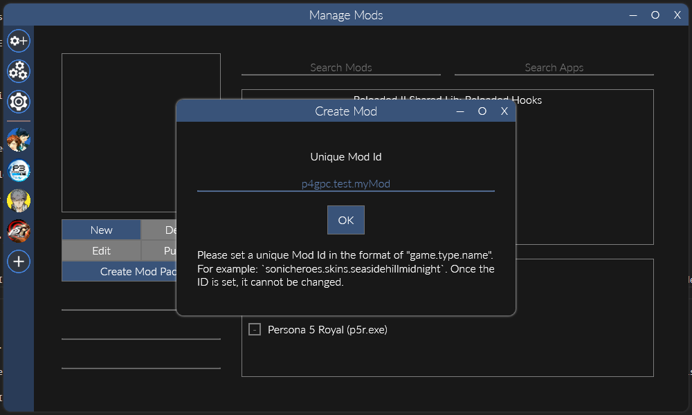
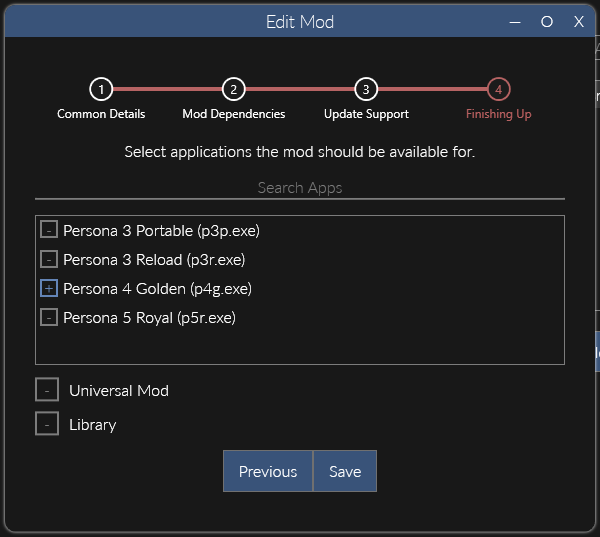
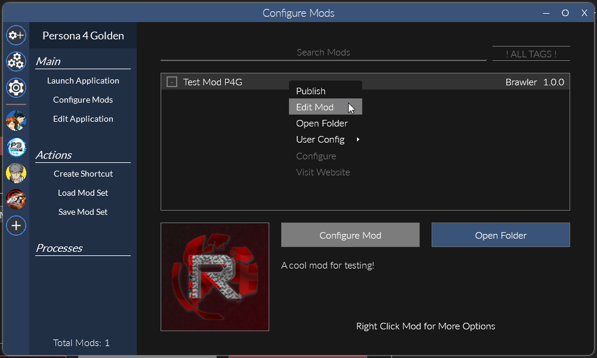

import { Aside } from "@astrojs/starlight/components";

<Aside>This is placeholder information from P4G and needs to be updated.</Aside>

<Aside>
    The process of making a mod in Reloaded-II is the same for every game that uses it. If you've made one for another game, you already know what you're doing!

    The only potential difference is that you should almost always enable Persona Essentials as a dependency for P3P/P4G/P5R mods.

</Aside>

The first thing you need to do make a new mod in Reloaded-II. All of your edited files will go in this, and it is what you'll release for others to use.

To do so, open up Reloaded-II, go to the **Manage Mods** tab, and click **New**.

From there, you'll need to enter an ID for your mod. This is a unique name that Reloaded-II will use to identify your mod. The recommended format is `game.name` or `game.type.name`, where

- `game` is the game the mod is for. In this case, either `p4g64` or `p4gpc`
- `type` is the category of the mod. For example, if the mod is an event mod, use `event` or similar as the type.
- `name` is the name of your mod.

However, it is not necessary to strictly follow this convention, just make sure it's unique and descriptive. Spaces and special characters should also be avoided.

<Aside type="caution">
  Your mod ID is something a user will generally never see. However, if
  Reloaded-II fails to download your mod (when it is a dependency of another),
  this ID **will** be displayed. Make sure it is something that describes your
  mod so people can search for that ID if they need to (keep it similar to the
  mod's title).
</Aside>

For example, I've named my mod `p4gpc.test.myMod`.

Next, you'll enter some basic details about your mod which will be displayed to users. Unlike the ID, these can be changed later. In particular, you'll probably leave the website blank until you're ready to publish the mod.

Now, we have to set dependencies for our mod. Dependencies allow you to use libraries, code, assets, etc. from other mods.

Generally, you should always set a dependency on Persona Essentials, but sometimes you will need dependencies on additional mods. For now, just search for Persona Essentials and enable it so there's a colored cross next to the name.

After that you can skip over the **Update Support** section without changing anything, we'll do that once the mod's ready for publishing.

Finally you need to set the game your mod is for. Usually this will only be one game, but if you want you can make a mod that supports multiple, or even all games.
For now, just enable Persona 4 Golden and click save.

Now you should see your new (currently empty) mod in your list of P4G mods.

<Aside type="tip">
    If you don't see your mod, go back to the Manage Mods tab and double check that you enabled the correct game for it (see the previous step).

    The Manage Mods tab always shows all mods for all games added to Reloaded-II, so you can refer to it if something's missing.

</Aside>

If you want to edit any of the details for your mod, you can right click it and press **Edit Mod**. This will bring up the same dialog that you used when initially making the mod.

