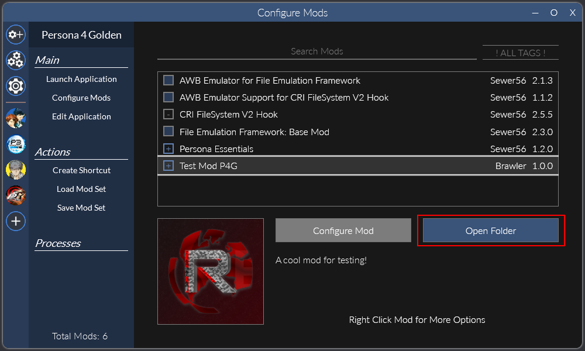
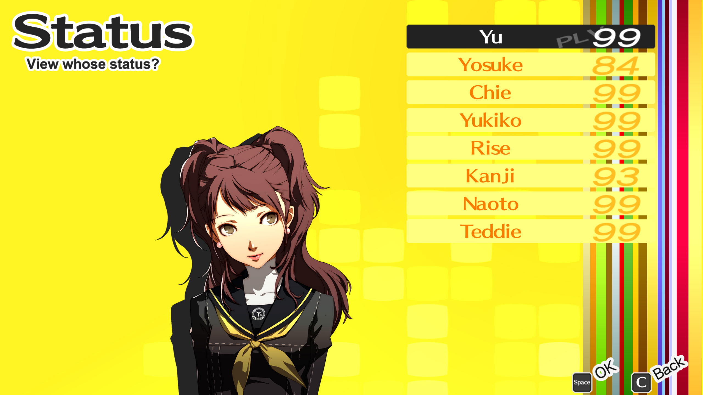
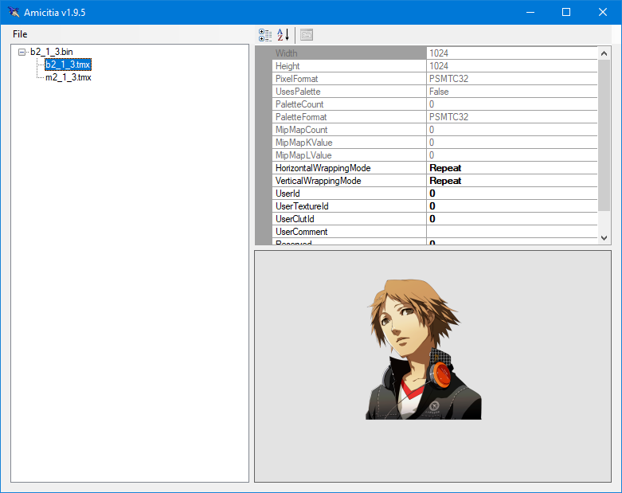

import { Aside, FileTree } from "@astrojs/starlight/components";

<Aside>This is placeholder information from P4G and needs to be updated.</Aside>

Now that you have [made a mod](../making-a-mod), you can start adding your modded files to replace the game's files. There are two broad types of files which are replaced in different ways: **loose** files and **packed** files.

<Aside>
  This process is exactly the same as P3P/P5R. If you've made mods that replace
  files in them then you already know how to do it for P4G!
</Aside>

## Replacing Loose Files

Loose files are the simplest - they are _loose_ in some folder in the game's files.

To replace these, first select your mod in Reloaded-II and click Open Folder.

This will take you to the root folder for your mod. In here, make folders in the structure `P5REssentials\CPK\data.cpk`

<FileTree>
  - p4g64.test.myMod 
    - ModConfig.json Automatically managed by Reloaded-II 
    - P5REssentials 
      - CPK 
        - data.cpk/
</FileTree>

<Aside>
    The folder named `data.cpk` can actually be named anything. The name has no special meaning and is just used as an example.

    If you wanted, you could even organise your mod by having multiple folders under the `P5REssentials\CPK` folder.

</Aside>

Now, take a look at the file path of the original file in your dump of the game's files. You will need to recreate this path underneath the `P5REssentials\CPK\umd0.cpk` folder.

For example, P4G has status menu bustups for each character under the `camp\bustup` folder in `data.cpk`.
To replace the protagonist's winter uniform bustup, which uses the file `c_cha01a.tmx`, you would put a modified file with the same name at `P5REssentials\CPK\umd0.cpk\camp\bustup\c_cha01a.tmx`.

<Aside type="tip">
  You can use
  [Amicitia](https://github.com/tge-was-taken/Amicitia/releases/latest) to view
  `tmx` files. TODO link to a page with details on editing them!
</Aside>

Your mod would end up looking like:

<FileTree>
  - p4g64.test.myMod 
    - ModConfig.json Automatically managed by Reloaded-II 
    - P5REssentials 
      - CPK 
        - data.cpk 
          - camp 
            - bustup 
              - **c_cha01a.tmx**
</FileTree>

Loading up the game you should then see that the protagonist's bustup is replaced with your new one. In my case, I just copied Rise's bustup (`c_cha05a.tmx`) and renamed it.

## Replacing Packed Files

Packed files are a bit more complicated. They are inside of an archive file (think a zip archive) which we call a PAK.

<Aside>
  PAK archives can have many different file extensions like `pak`, `pac`, and
  `bin` although they are all actually the same format.
</Aside>

To replace these, open your mod folder as before and create folders in the structure `FEmulator\PAK`.
Similarly to loose files, you need to recreate the path to the PAK file under this `FEmulator\PAK` folder.

For example, one of Yosuke's bustups used in dialogue is found in `b2_1_3.bin` in `data.cpk\bustup`.
Open this file up in [Amicitia](https://github.com/tge-was-taken/Amicitia/releases/latest) and you'll see that the bustup and blink textures are under `b2_1_3.tmx` and `m2_1_3.tmx` respectively in this file.

To replace this file, you would then need to put modified tmx files with the same names at `FEmulator\PAK\bustup\b2_1_3.bin\b2_1_3.tmx` and `FEmulator\PAK\bustup\b2_1_3.bin\m2_1_3.tmx`.
Your mod would then look like

<FileTree>
  - p4gpc.test.myMod 
    - ModConfig.json Automatically managed by Reloaded-II 
      - FEmulator 
        - PAK 
          - bustup 
            - b2_1_3.bin 
              - **b2_1_3.tmx** 
              - **m2_1_3.tmx**
</FileTree>

There are two things to note here:

Firstly, `b2_1_3.bin` is the path to the PAK file. You need to replicate the folders leading up to it.

Secondly, everything nested inside `b2_1_3.bin` is the path inside of the PAK file. In this case, the files are in the root of the PAK file, but if they were not at the root, you would need to replicate the path shown in Amicitia. In some cases, this path can even include PAKs in PAKs. Just follow what Amicitia shows and you should be fine.

Now if you open up the game you should see that Yosuke's bustup in dialogue is replaced with your edited one. In my case, I've again just replaced it with Rise :)

## Other Files

The above will allow you to replace most of the games files, however, for some types the process is a bit different or there are additional steps.
See the following pages for more details on certain file types:

<Aside type="caution">
  These docs are still very WiP so I don't actually have pages to link to yet!
</Aside>

- BF Files
- BMD Files
- SPR Files
- Music Files
