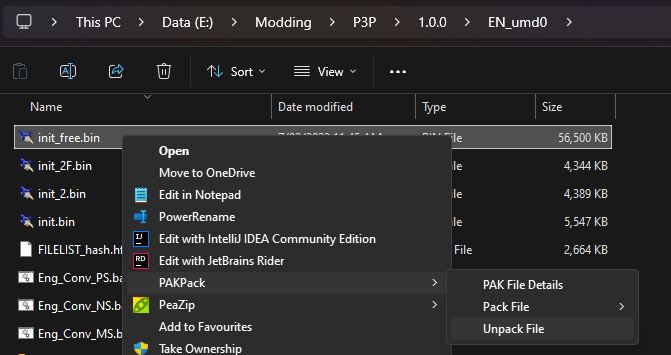

import { Aside, Tabs, TabItem } from "@astrojs/starlight/components";

Before you start making your mod you'll need to extract the game's base files so you can find what you actually want to edit.

<Aside>
  This process is exactly the same as P4G and P5R. If you've extracted their
  files previously you already know how to do it for P3P!
</Aside>

## Extracting CPKs

All of the game's files are stored in CriWare CPK files named `umd0.cpk` (containing most files) and `umd1.cpk` (containing audo and video files).

To unpack these you'll need to download [CriFsV2Lib.GUI](https://github.com/Sewer56/CriFsV2Lib/releases/latest). Select the file called `CriFsLib.GUI.zip` and extract it somewhere.
From there run `CriFsLib.GUI.exe` and you'll be greeted with a window asking you to select a CPK file.

<Aside>
The main cpks (under the `data` folder) will contain anything that doesn't change with the language (like models) plus the Japanese versions of all files.

The other cpks (under the `data_XX` folders) will **only** contain the files that are specific to that language (mostly text).

</Aside>

Drag your desired CPK into the program and you'll be shown the names of all files inside it. Right click any file, click **Extract All** and select an appropriate folder; after a little bit all of the files will be extracted into it.


## Extracting Archives (PAKs)

When you look through your extracted files you'll find there are many large `bin`, `pac`, and `pak` files. These are archives (collectively referred to as `PAK` files) which contain files inside of them. To extract these you'll need to use one of the following tools.

<Aside>
  Sometimes the `bin` extension is also used for files that are not PAK
  archives. If the normal tools don't seem to work on a file, then it probably
  is a raw binary file rather than an archive.
</Aside>

### Amicitia GUI

The easiest way to extract files from these archives is [Amicitia](https://github.com/tge-was-taken/Amicitia/releases/latest). Download the `Release.7z` and extract it somewhere appropriate. When you open a file in Amicitia, if it is a valid archive you'll see a tree of files that you can export or replace by right-clicking on them.


### PersonaEditor GUI

[PersonaEditor](https://github.com/Meloman19/PersonaEditor/releases/latest) is an alternative program. While Amicitia is preferred in most cases, PersonaEditor is more useful for some file types, and features limited built-in text editing support. It has a similar UI to Amicitia.


### Command Line

Although Amicitia is the most user friendly, it's not good for batch extracting files as you can only select one at a time. If you need to perform batch operations you can download [PackTools](https://github.com/tge-was-taken/AtlusFileSystemLibrary/releases/latest).

<Aside>
  Pack Tools is a CLI (command line interface) so double clicking on
  `PAKPack.exe` will do nothing. You need to run it through the terminal to use
  it.
</Aside>

Running it without any arguments will give you some help information. The command you'll likely want to use is `unpack` to extract files from an archive. For example, a simple command to extract all .bin files in a folder (and subfolders) is:

<Tabs>
<TabItem label="Command Prompt">
```bat
for /R "Path\To\Folder" %i in (*.bin) do "Path\To\PAKPack.exe" unpack %i
```
</TabItem>

<TabItem label="PowerShell">
```powershell
Get-ChildItem "Path\To\Folder" -Recurse -Filter *.bin | Foreach {&"Path\To\PAKPack.exe" unpack $_.fullname}
```
</TabItem>
</Tabs>

### Context Menu

The final way to extract files is using [PAKPack-Registry](https://github.com/LTSophia/PAKPack-Registry/releases/latest) which adds a context menu option to unpack and pack PAK archives. After downloading and extracting it just run `PAKPack Registry.exe` and you're good to go.

Now whenever you right-click a file you'll have a **PAKPack** option at the top of the menu which can be used to extract the PAK.



## Other Files

This page focused on extracting archives, but to do anything useful you need to work with the files you've gotten from those archives.

Have a look at one of the following sections for more details on working with different types of files:

<Aside type="caution">
  These docs are still very under construction so I don't have a list of pages
  to link to yet! TODO add a list :)
</Aside>
