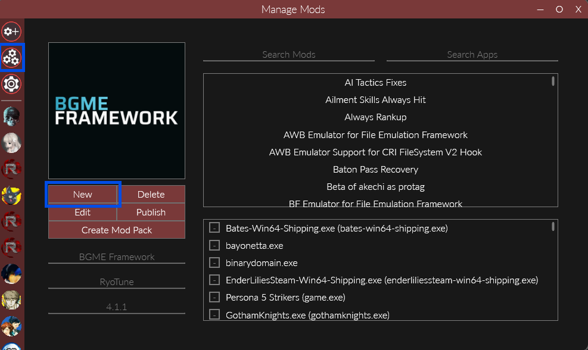
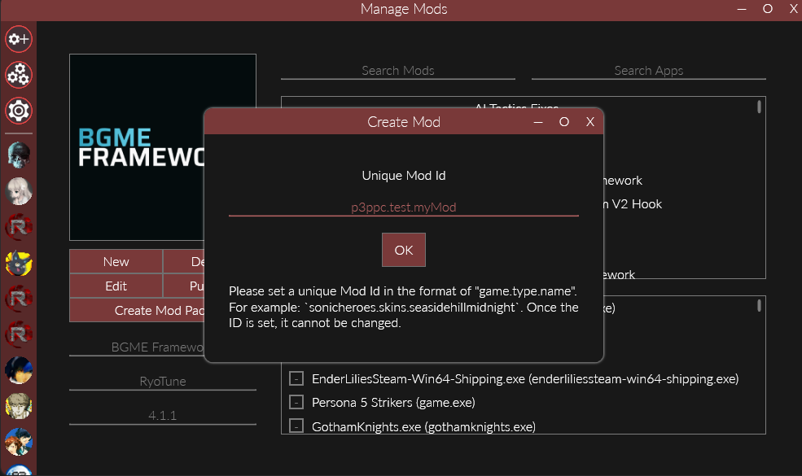
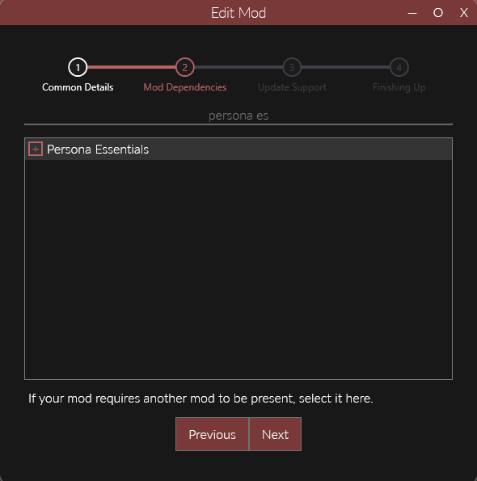
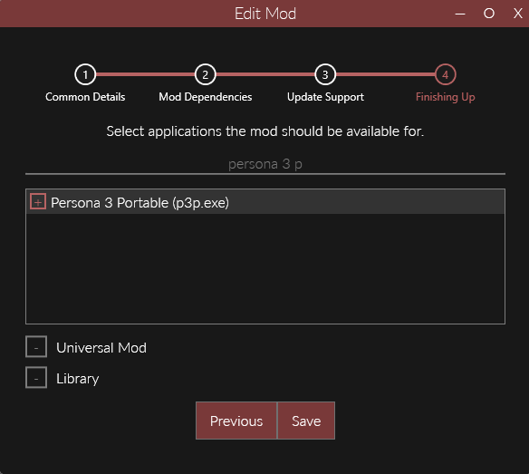
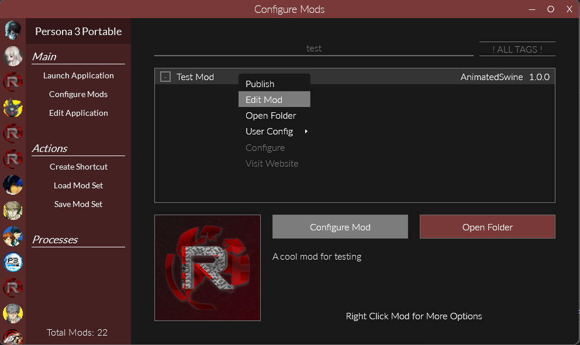

import { Aside } from "@astrojs/starlight/components";

<Aside>
    The process of making a mod in Reloaded is the same for every game. If you've made one for another game, you already know what you're doing!

    The only potential difference, is that you should almost always enable Persona Essentials as a dependency for P3P mods.

</Aside>

When making a mod the first thing you need to do make it in Reloaded. All of your edited files will go in this, and it is what you'll release for others to use.
To do so open up Reloaded, go to the **Manage Mods** tab, and click **New**.

From there you'll need to enter your mod's id. This is a unique name that Reloaded will use to identify your mod. The recommended format is `game.type.name` although you don't _need_ to strictly follow it, just make sure it's unique.

<Aside type="caution">
  Your mod id is something a user will generally never see. However, if Reloaded
  fails to download your mod (when it is a dependency of another) this id
  **will** be displayed. Make sure it is something that describes your mod so
  people can search for that id if they need to (keep it similar to the mod's
  title).
</Aside>

For example, I've named my mod `p3ppc.test.myMod`

Next you'll enter some basic details about your mod. Unlike the id, these can be changed later, so don't worry too much about them. In particular you'll probably leave the website blank until you're ready to publish the mod.

Now we have to set dependencies for our mod. Generally you should always set a dependency on Persona Essentials, however sometimes you will need dependencies on additional mods.
For now, just search for Persona Essentials and enable it so there's a coloured cross next to the name.

After that you can skip over the **Update Support** section without changing anything, we'll do that once the mod's ready for publishing.

Finally you need to set the game your mod is for. Usually this will only be one game, but if you want you can make a mod that supports multiple, or even all games.
For now, just enable Persona 3 Portable and click save.

Now you should see your new (currently empty) mod in your list of P3P mods.

<Aside type="tip">
    If you don't see your mod, go back to the manage mods tab and double check that you enabled the correct game for it (see the previous step).

    The manage mods tab always shows all mods for every game so you can refer to it if something's missing.

</Aside>

If you want to edit any of the details for your mod you can right click it and press **Edit Mod**. This will bring up the same dialog that you used when initially making the mod.

