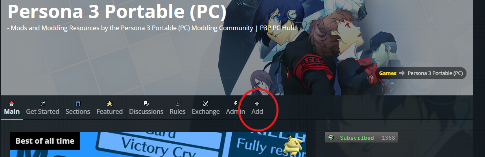
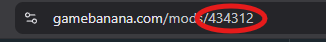
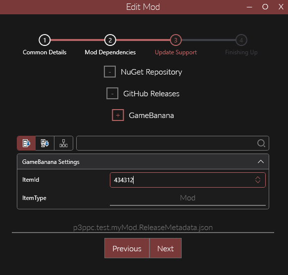
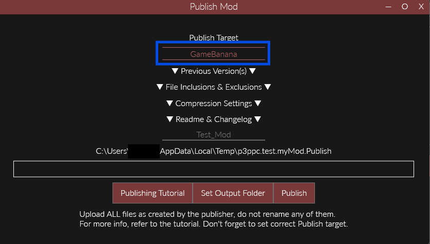
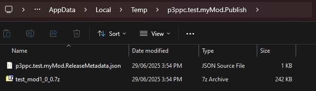

import { Aside } from "@astrojs/starlight/components";

<Aside>This is placeholder information from P3P and needs to be updated.</Aside>

Now that you have [made a mod](../making-a-mod) and [replaced some files](../replacing-files) with it, you'll want to share your creation with the world.

<Aside>
  Publishing a Reloaded mod to [Gamebanana](https://gamebanana.com/) (where most
  Persona mods are posted) is the same for every game. If you've previously
  posted Reloaded mods to GameBanana then you already know how to do it for P3P!
</Aside>

## Setting up a mod page

It is important to set up a mod page first, as the ID of your mod page is required in order to set up automatic updates in Reloaded. Otherwise, mods will not be available for one-click install on GameBanana and they won't receive updates.

Go to the [P3P PC GameBanana page](https://gamebanana.com/games/16613), and click the Add button.

Select an appropriate section for your mod; most mods will simply fall under `Mod`, but some may fall under `Sound` for music/SFX mods, `Tool` for applications related to mod making, etc.

Fill out the required fields:

- Main
  - Mod Title
  - Mod Category: _Choose the category that best describes your mod._
  - Body
- Ownership
  - Is this a port?
  - Did you create this Mod?
  - Authors
  - Screenshots
  - Files: _Placeholder file(s) can be uploaded for now, but make sure to add the relevant mod files before posting the mod publicly._
- Settings
  - Access: **_Set this to private!_**

:::warning
Before saving, **remember to set the mod access to Private!** Otherwise you will publicly publish a mod with no content in it!
:::

Click Submit at the bottom, and you will be taken to the mod page. Your mod ID is found in the URL. Save this for the next step!

## Setting Update Support

In Reloaded, select your mod, click Edit, and go to **Update Support**.

Click on GameBanana, then set `ItemId` to the mod ID you got previously. Also set `ItemType` to the category your mod is in (Mod, Sound, etc).

## Publishing Your Mod

Now select your mod and click Publish. Set your Publish Target to GameBanana, set a readme and/or changelog file as desired, then click Publish.

:::info
For more details, click on Publishing Tutorial or go to the [Reloaded II documentation](https://reloaded-project.github.io/Reloaded-II/CreatingRelease/).
:::

After publishing your mod, it will export the files to the directory shown in the Publish Mod window and automatically open a new window to that filepath.

There will be two files:

- A compressed file with your mod in it
- A JSON file with update information

Upload both of these files to the Files section of your mod page, finalize any other fields you may have left as placeholders, set mod access to Public, and then click Submit to publicly publish your mod!
