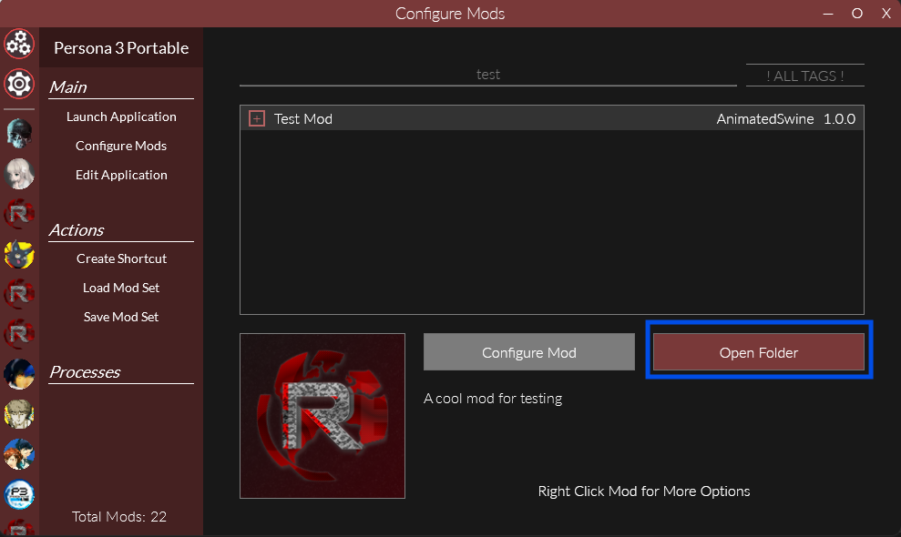
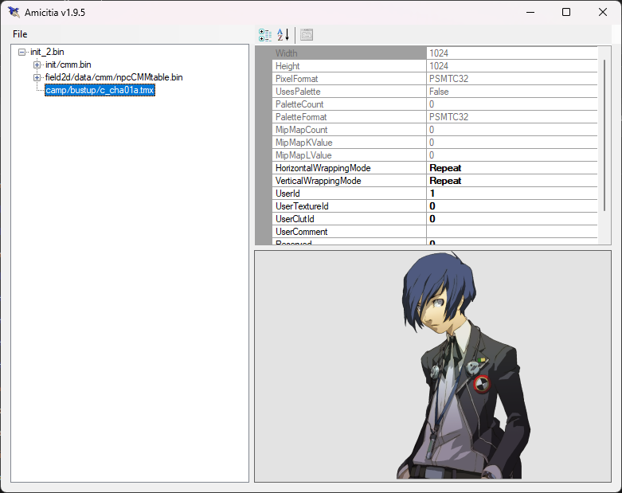
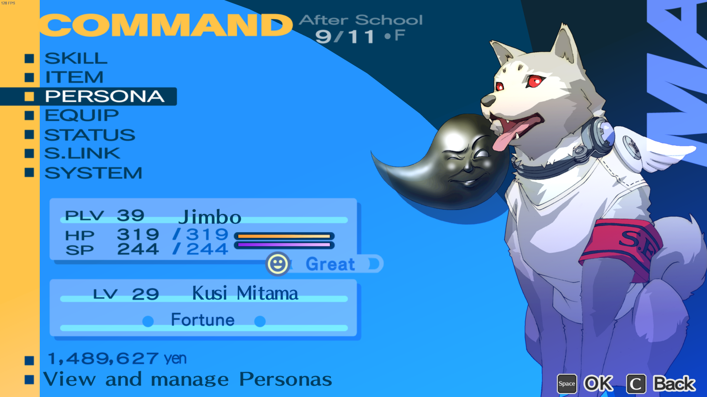

import { Aside, FileTree } from "@astrojs/starlight/components";

<Aside>This is placeholder information from P3P and needs to be updated.</Aside>

Now that you have [made a mod](../making-a-mod) you can start replacing the game's files. There are two broad types of files which you will replace in different ways: **loose** files and **packed** files.

<Aside>
  This process is exactly the same as P4G and P5R. If you've made mods that
  replace files in them then you already know how to do it for P3P!
</Aside>

## Replacing Loose Files

Loose files are the simplest, they are _loose_ in some folder in the game's files.

To replace these, first select your mod in Reloaded and click Open Folder.

This will take you to the root folder for your mod. In here make folders in the structure `P5REssentials\CPK\umd0.cpk`

<Aside>
    The folder named `umd0.cpk` can actually be named anything. The name has no special meaning and is just used as an example.

    If you wanted to you could even organise your mod by having multiple folders under the `P5REssentials\CPK` folder.

</Aside>

Now, take a look at the file path of the original file in your dump of the game's files. You will need to recreate this path underneath the `P5REssentials\CPK\umd0.cpk` folder.

For example, P3P has bustups for each character under the `camp\bustup` folder of the main `umd0.cpk` file.
To replace Junpei's bustup, which uses the file `c_cha05a.tmx` you would put a modified file with the same name at `P5REssentials\CPK\umd0.cpk\camp\bustup\c_cha05a.tmx`.

<Aside type="tip">
  You can use
  [Amicitia](https://github.com/tge-was-taken/Amicitia/releases/latest) to view
  `tmx` files. TODO link to a page with details on editing them!
</Aside>

Your mod would end up looking like:

<FileTree>
  - p3ppc.test.myMod 
    - ModConfig.json Automatically managed by Reloaded 
    - P5REssentials 
      - CPK 
        - umd0.cpk 
          - camp 
            - bustup 
              - **c_cha05a.tmx**
</FileTree>

Loading up the game you should then see that Junpei's bustup is replaced with your new one. In my case, I just copied Koromaru's bustup (`c_cha10a.tmx`) and renamed it.

<Aside>
  The protagonist's bustup (`c_cha01a.tmx` or `c_cha99a.tmx`) is not actually
  pulled from this folder so if you try replacing theirs like this it will not
  work! Their bustup is found in `init_2.bin`. See the below section on packed
  files for an example of replacing it.
</Aside>

## Replacing Packed Files

Packed files are a bit more complicated, they are inside of an archive file (think like a zip) which we call a PAK.

<Aside>
  PAK archives can have many different file extensions like `pak`, `pac`, and
  `bin` although they are all actually the same format.
</Aside>

To replace these, open your mod folder as before and create folders in the structure `FEmulator\PAK`.
Similarly to loose files, you need to recreate the path to the PAK file under this `FEmulator\PAK` folder.

For example, the male protagonist's bustup in the command menu is found in `init_2.bin` in the root of the language specific `umd0.cpk`.
Open this file up in [Amicitia](https://github.com/tge-was-taken/Amicitia/releases/latest) and you'll see that it is under `camp/bustup/c_cha01a.tmx` in this file.

<Aside type="tip">
  If you wanted to replace the female protagonist's bustup you would do the same
  thing but look under `init_2F.bin` instead of `init_2.bin`.
</Aside>

To replace this file, you would then need to put a modified tmx with the same name at `FEmulator\PAK\init_2.bin\camp\bustup\c_cha01a.tmx`.
Your mod would then look like

<FileTree>
  - p3ppc.test.myMod 
    - ModConfig.json Automatically managed by Reloaded 
    - FEmulator 
      - PAK 
        - init_2.bin 
          - camp 
            - bustup 
              - **c_cha01a.tmx**
</FileTree>

There are two things to note here:

Firstly, `init_2.bin` is the path to the PAK file. In this case it is at the root of the game's files so it is directly under `FEmulator\PAK`, however, if it was not at the root you would need to replicate the folders leading up to it.

Secondly, `camp/bustup/c_cha01a.tmx` is the path inside of the `init_2.bin` PAK file. This is copied from what is shown in Amicitia. In some cases, this path can even include PAKs in PAKs. Just follow what Amicitia shows and you should be fine.

Now if you open up the game you should see that the protagonist's bustup in the command menu is replaced with your edited one. In my case, I've again just replaced it with Koromaru :)

## Other Files

The above will allow you to replace most of the games files, however, for some types the process is a bit different or there are additional steps.
See the following pages for more details on certain file types:

<Aside type="caution">
  These docs are still very WiP so I don't actually have pages to link to yet!
</Aside>

- BF Files
- BMD Files
- SPR Files
- Music Files
