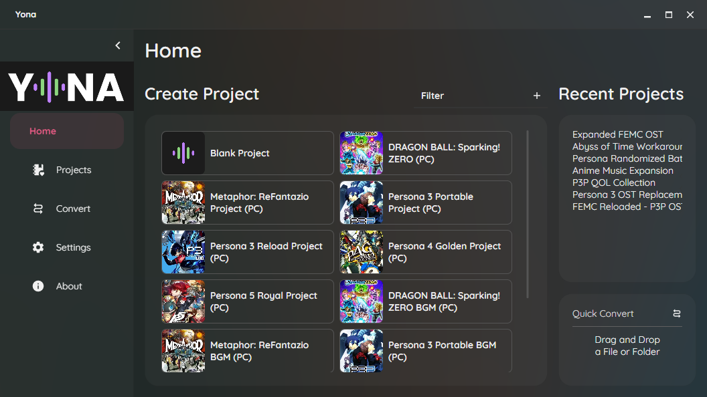
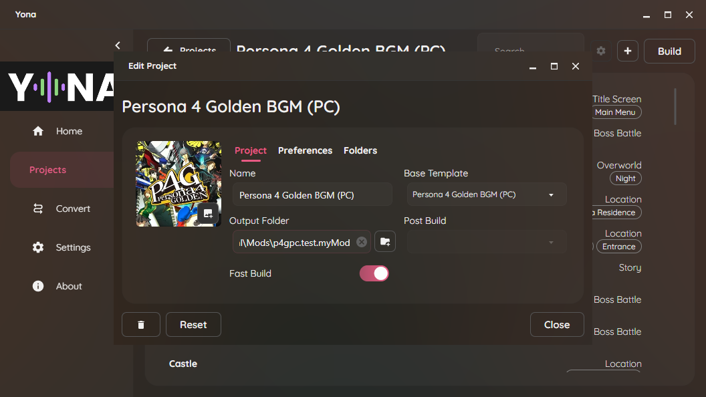
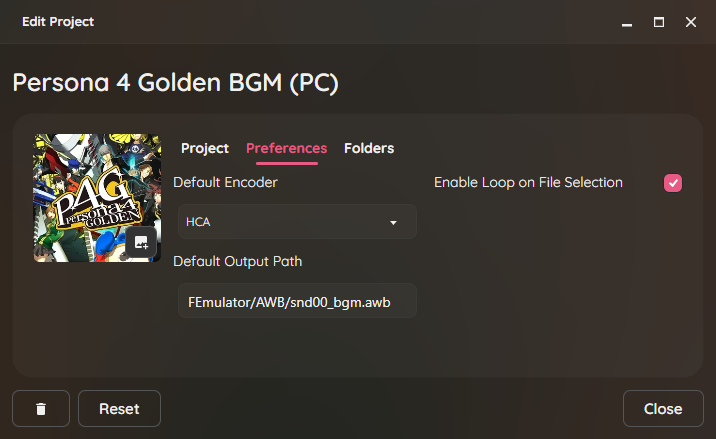
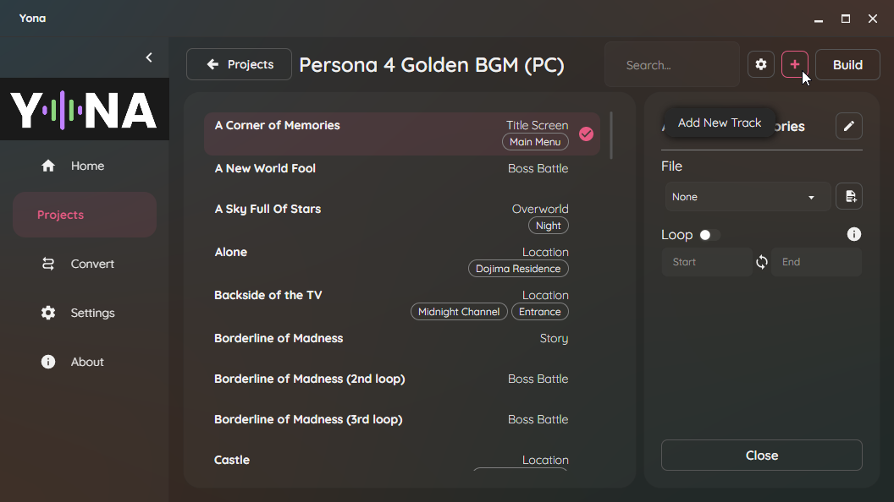
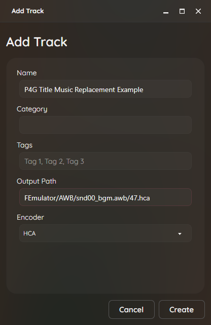
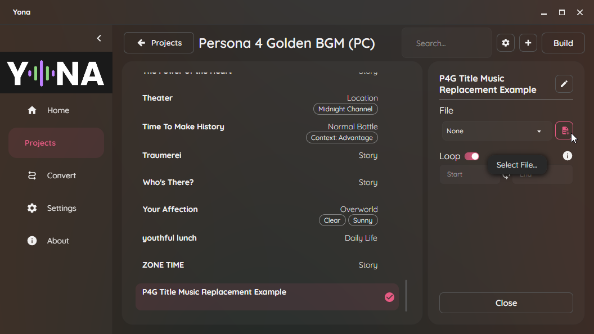
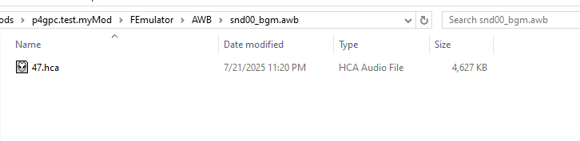
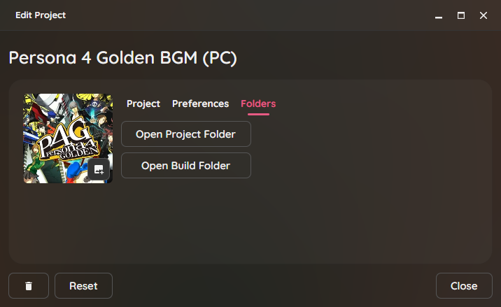
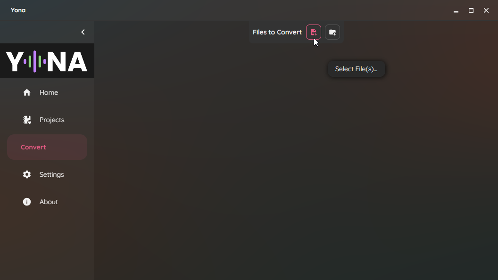
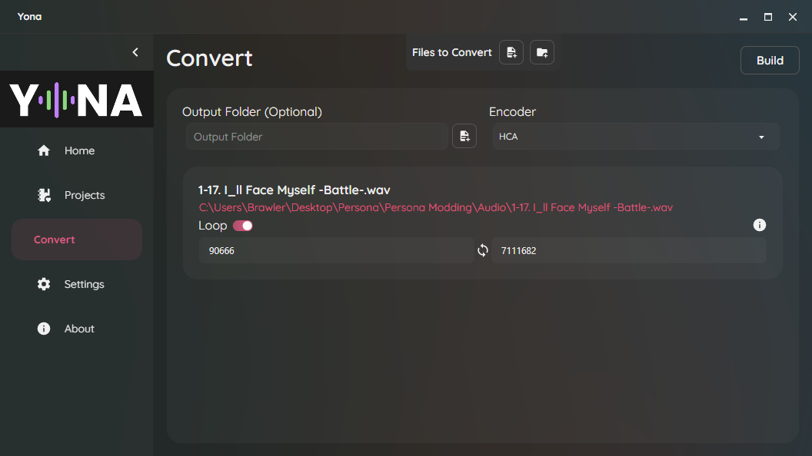

import { Aside, Tabs, TabItem } from "@astrojs/starlight/components";

Audio conversion is primarily done using [Yona](https://github.com/RyoTune/Yona), an audio manager and converter tool. It automatically handles all steps to encode and export audio for Persona 4 Golden (PC).

:::note
Yona has detailed documentation which can be found [here](https://ryotune.github.io/guides/audio/music-replacement-yona/)!
:::

When booting up the program, you will be brought to the Home menu, which shows you preset projects for supported games.

### Projects

Yona supports projects, which can be used to easily convert larger numbers of audio files and/or organize your files.

Upon opening Yona, you can create a new project by selecting one of the Persona 4 Golden templates or starting a new blank project.

#### Project Setup
After creating your project, click on **Edit Project** in the top right (the settings cog).

Under **Output Folder**, navigate to `Reloaded-II/Mods/<your mod>`. For example, using the example mod `p4gpc.test.myMod` created in [Making A Mod](/p4g/getting-started/making-mods/making-a-mod/), the output folder would be `Reloaded-II/Mods/p4gpc.test.myMod`.

Under the **Preferences** tab, make sure to set the **Default Output Path**. If you are editing existing music, this should generally be set to `FEmulator/AWB/snd00_bgm.awb`; this is selected by default if using the **Persona 4 Golden BGM (PC)** project template.

#### Adding Audio Files
To add a new audio file, click on the **Add New Track** button in the top right.

In the menu that opens, add the name of the file and specify the output path. Note that the output path field is already prepopulated with whatever you set the default output path as in [Project Setup](#project-setup). For example, if you want to replace `47.hca` (A Corner of Memories, P4G's main menu music) in `snd00_bgm.awb`, it would look something like this.

Select this new entry, then select your audio file by clicking on the **Select File...** button. Then, enable looping and enter your start and end loop points as needed.

#### Building Audio Files
Once you have configured all your audio as desired, click the **Build** button in the top right. This will build your audio files in the output folder location you set up in [Project Setup](#project-setup).

<Aside type="tip">
  To quickly get to your output folder, open your project settings and go to the **Folders** tab. Then, click **Open Build Folder**.
  
</Aside>

### Simple Conversion

The **Convert** tab can be used to quickly convert audio files. Select either the **Select File(s)...** or **Select Folder(s)...** to select the audio file(s) you want to convert.

Once you have selected your file(s), ensure the encoder is set to **HCA**. If you want the audio to loop, toggle the loop option and enter the start and end points. Leaving the start and end points blank will cause the audio to loop from the very start or the very end respectively.

<Aside type="danger">
  Currently, attempting to select an Output Folder crashes Yona. This may be fixed in future updates, but until then, do not click this option.
</Aside>

Click the **Build** button in the top right, and your file(s) will be converted to audio files that are usable in Persona 4 Golden. You will then need to rename and place these files in the appropriate location(s).