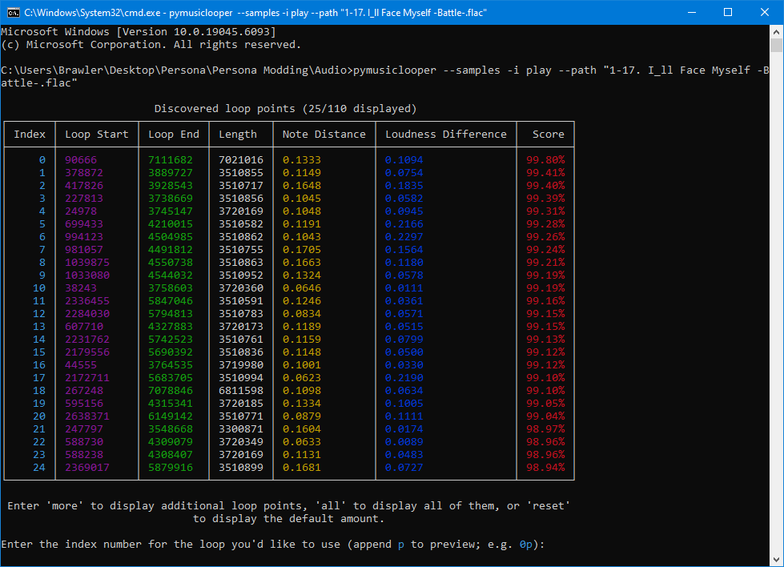

## Prerequisites

To create audio files for Persona 4 Golden (PC), you will need the following at minimum:

- The audio file you're adding in WAV format
  - If your file is not a WAV, you'll want to convert it using [FFmpeg](https://ffmpeg.org/) (this can be installed for Audacity following [these instructions](https://support.audacityteam.org/basics/installing-ffmpeg))
- [Yona](https://github.com/RyoTune/Yona)

To loop audio files (for music or repeating SFX, etc.), you will need the following:

- [PyMusicLooper](https://github.com/arkrow/PyMusicLooper) - to automatically find loop points
  - Prerequisite: [Python (64-bit)](https://www.python.org/downloads/) >= 3.10
- [Audacity](https://www.audacityteam.org/download/) - to manually find loop points or for other basic audio editing

## Audio Editing

Music and certain sound effects use loops defined within the data of the audio files, so they will continuously play as long as they are being called/used. These need to be set up so that the audio file will repeat correctly.

If you are editing an audio file that requires looping, read [Looping Audio](#looping-audio). Otherwise, skip to [Converting Audio](#converting-audio)

## Looping Audio

If your audio file requires loops, you will need to find and set up loop points, which tell the audio where to start looping again. In some cases, this is as simple as finding start and end loop points, and in other cases, more advanced audio editing needs to be done in order to ensure a clean sounding loop. Generally, video game songs tend to be composed with looping in mind, but other songs may be more difficult to loop.

### Automatically Finding Loop Points

The simplest way to get loop points is to use [PyMusicLooper](https://github.com/arkrow/PyMusicLooper) to automatically find optimal loop points. PyMusicLooper is a command-line interface (CLI) program, which means you have to run it by directly inputting commands into a terminal rather than using a GUI like with many other programs.

Open a terminal in the same spot as your audio files (either command prompt or Powershell). Type in the following command: `pymusiclooper -i export-points --path <audio file>`

The program will take a few seconds to process the audio file and try to find the best loop, then it will output the following:

The best loop points that the program has found are displayed in the output. As shown at the bottom of the output, you can select a loop by typing in its index number, and by appending `p`, you can preview the loop to make sure it sounds good before selecting it.

Generally, the lower the index, the better the loop will be, but make sure the loop captures the entire segment of the song you want; as long as the score is high enough (&gt;95%), the loop will generally sound fine.

:::note
It is highly recommended that you listen to the preview to ensure that the loop actually sounds good. You can input `Ctrl + C` once to stop the song from continuing to loop, and again to stop the song playback and return to the loop point menu. For example, to preview the loop with index 0, type `0p`.
:::

Once you've found a loop you like, type in the index to get the start and end loop points.

Save these loop points; you will use them when [converting your audio](#converting-audio).

### Looping from Start to End

For a simple loop where you loop from the very start to the very end of the audio file, you do not need to find the specific loop points; you can automatically create this loop when converting your file. Skip to [Converting Audio](#converting-audio) for more details.

### Manually Finding Loop Points

In some cases, you may need to manually find loop points. For example, PyMusicLooper may not give you a desirable loop, you might need to do some audio editing to create a decent loop, etc.

To do this, open your replacement audio file in [Audacity](https://www.audacityteam.org/download/). Select the start and end of the section of song you want to loop, then set the selection toolbar (at the bottom of the screen) to "Start and End of Selection" with the time displayed as samples.

With newer versions of Audacity, you can preview the loop by clicking the **Enable Loop** button. If using an older version of Audacity, click the Play button or somewhere on the timeline while holding `Shift`.

Save these loop points; you will use them when [converting your audio](#converting-audio).

## Converting Audio

:::note
This section isn't done yet! (obviously)
:::
