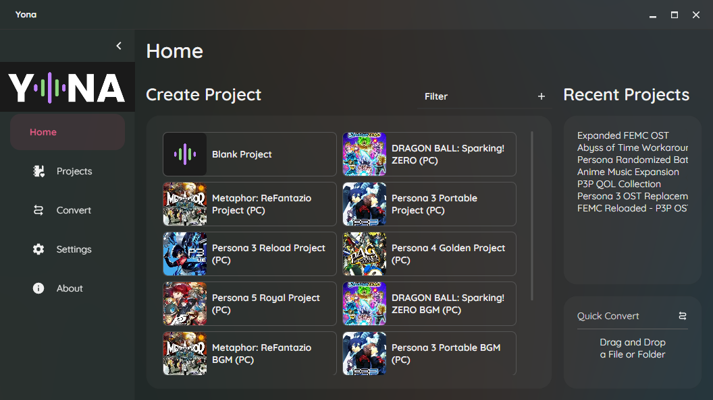
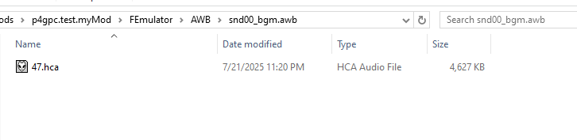

import { Aside, Tabs, TabItem } from "@astrojs/starlight/components";

[Yona](https://github.com/RyoTune/Yona) includes a project template to easily replace songs in Persona 4 Golden (PC).

:::note
Yona has detailed documentation which can be found [here](https://ryotune.github.io/guides/audio/music-replacement-yona/)!
:::

When booting up the program, you will be brought to the Home menu, which shows you preset project templates for supported games.

Select the **Persona 4 Golden BGM (PC)** as your project template.

#### Project Setup
After creating your project, click on **Edit Project** in the top right (the settings cog).

Under **Output Folder**, navigate to `Reloaded-II/Mods/<your mod>`. For example, using the example mod `p4gpc.test.myMod` created in [Making A Mod](/p4g/getting-started/making-mods/making-a-mod/), the output folder would be `Reloaded-II/Mods/p4gpc.test.myMod`.

#### Replacing Music
In your project, you will see a list of songs in Persona 4 Golden. Select the song you want to replace, and click the **Select File...** button.

Select your audio file by clicking on the **Select File...** button. Then, enable looping and enter your start and end loop points as needed. For example, we will be replacing P4G's title screen music (A Corner of Memories).

Once you have set up replacements for all of your audio as desired, click the **Build** button in the top right. This will build your audio files in the output folder location you set up in [Project Setup](#project-setup).

<Aside type="tip">
  To quickly get to your output folder, open your project settings and go to the **Folders** tab. Then, click **Open Build Folder**.
  
</Aside>